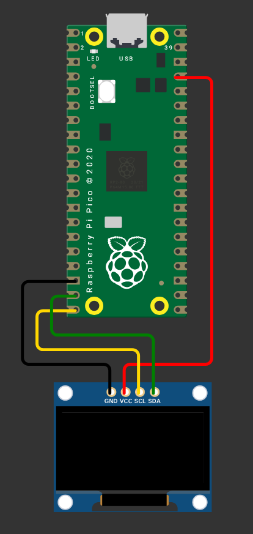

# 0.96" 128x64 OLED Display

No name clone [Adafruit 128x64 OLED display](https://www.adafruit.com/product/326) from Aliexpress. Very cheap (around 1.5GBP) from China.

## Basic info
- VCC: 3V3 (supposedly 5V tolerant but did not test)
- Interface: I2C (address 0x3C)
    - Max frequency: 3.25MHz
- SSD1306 Controller ([datasheet](https://cdn-shop.adafruit.com/datasheets/SSD1306.pdf))

# Setup

# Sketch

Simple drawing example with lines and text. Displays refresh rate.

# Quirks

- I2C address of the Adafruit display is `0x3D`. Chinese clone has I2C address `0x3C`.

# Evaluation

- The display is visible indoors during the day, which is minimum I need.
- Surprisingly high refresh rate - 160fps @ 3.25MHz I2C
- If you swap VCC and GND wires, the display gets really hot and starts to smell. But it still works
